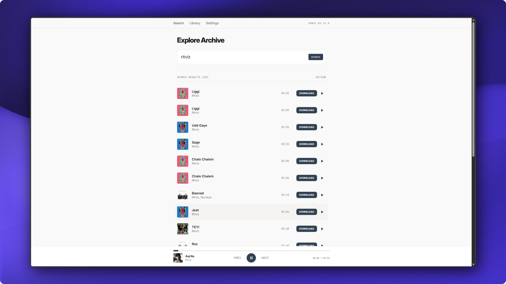

# Sonic

<p align="center">
  
</p>

<p align="center">
  <strong>A calm, fast workspace for finding and playing music.</strong><br>
  Search, stream, save, and download from one focused interface.
</p>

Sonic is a focused music search, streaming, and download app built with
TanStack Start. Search for tracks, play them in the browser, save favorites to
your local library, and download audio through a configurable API endpoint.

## Highlights

- Fast track search with a clean, keyboard-friendly interface
- Persistent in-browser player with queue controls
- Local library for saved tracks and favorites
- Configurable API endpoint from the Settings page
- Server-side download route with a small, deployable TanStack Start server
- Responsive UI built with React, Tailwind CSS, and shadcn/ui primitives

## Tech stack

- [TanStack Start](https://tanstack.com/start) — full-stack React framework
- [TanStack Router](https://tanstack.com/router) — type-safe file-based routing
- [React](https://react.dev/) and [TypeScript](https://www.typescriptlang.org/)
- [Tailwind CSS](https://tailwindcss.com/) and [shadcn/ui](https://ui.shadcn.com/)
- [Bun](https://bun.sh/) — package manager and local runtime

## Requirements

- Bun 1.2 or newer
- A music API that supports the endpoint configured in the app

## Getting started

Clone the repository, install dependencies, and start the development server:

```bash
git clone https://github.com/999shotoo/music-downloader.git
cd music-downloader
bun install
bun run dev
```

Open [http://localhost:3000](http://localhost:3000) in your browser. If Vite
selects a different port, use the URL shown in the terminal.

## Available scripts

| Command | Description |
| --- | --- |
| `bun run dev` | Start the Vite development server |
| `bun run build` | Create a production build |
| `bun run build:dev` | Build using the development mode |
| `bun run preview` | Preview the production build locally |
| `bun run lint` | Run ESLint |
| `bun run format` | Format the codebase with Prettier |

## Configuration

The API endpoint is configured from the **Settings** screen and stored in the
browser. No account or database is required for the local library: saved
tracks use browser storage on the current device.

The server exposes the public download route at:

```text
/api/public/download
```

Keep API credentials out of source control. Prefer environment variables or a
server-side secret manager when deploying an API that requires authentication.

## Project structure

```text
src/
├── components/       Shared application and UI components
├── hooks/            Reusable React hooks
├── lib/              Storage, settings, music, and error utilities
├── routes/           File-based pages and API routes
├── router.tsx        Router creation and route context
├── server.ts         TanStack Start server entry
└── styles.css        Global styles and design tokens
```

Routes are file-based. Add pages under `src/routes/`; the generated
`src/routeTree.gen.ts` file is maintained by the TanStack tooling and should
not be edited manually.

## Production build

Build and preview the application with:

```bash
bun run build
bun run preview
```

Choose a deployment target supported by TanStack Start and configure the music
API endpoint for that environment before publishing the server.

## Contributing

1. Create a feature branch.
2. Make focused changes and keep generated files untouched unless tooling
   updates them.
3. Run `bun run lint` and `bun run build`.
4. Open a pull request with a concise description of the user-facing change.

## License

No license has been published for this repository yet.
